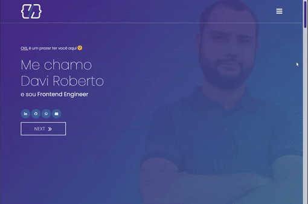

<section align="center">

# Davi Roberto - Frontend Engineer

## Hello, world 💻

This is my personal website, where I report about my career in frontend web development.

</section>

## 📖 Guide

1. What I used to develop
2. Necessary
3. Installing the project
4. Running
5. Prettier
6. ESlint
7. Build
8. Info

 

## 🚀 What I used to develop

- Next.js
- React
- TypeScript
- Bootstrap
- Styled Components
- Prettier
- ESLint
- Pre-commit with Husky
- And other technologies...
   
   

## ✅ Required

- Node 14 (LTS Version)
- Yarn 1.22.17
   
   

## 📦 Install Dependencies

Run `yarn` for intall dependencies.
 
 

## 🌐 Development server

Run `yarn dev` for start local server.
 
 

## 📈 Prettier

- Run `yarn run pretty:format` to format project files using prettier settings.

- Run `yarn run pretty:check` to validate that the files are formatted in the configured prettier pattern.
   
   

## 🛠️ ESlint

- Run `yarn lint` to check if the project is outside an established standard or if it has bugs and problematic code.
   
   

## ⚙️ Build

- Run `yarn build` to generate a build of the project.
   
   

## ℹ️ Info:

- Pre-commit: When adding a commit, some checks will be performed to validate the commit before uploading. You can see what these checks are in `package.json - lint-staged`
