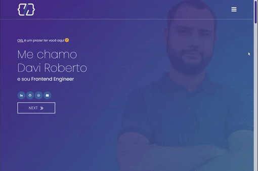

# Davi Roberto - Frontend Engineer

## Hello, world 💻

  
PT-BR

Sou um Frontend Engineer apaixonado com uma base sólida em tecnologias web. Minha jornada me levou a trabalhar em projetos diversos, cada um contribuindo para meu crescimento e conjunto de habilidades

## O Que Você Encontrará

- **Portfólio:** Explore uma coleção de projetos que destacam minhas habilidades e criatividade.
- **Experiências:** Mergulhe em minha jornada profissional, descobrindo os desafios que enfrentei e as soluções que criei.
- **CV:** Obtenha uma visão geral das minhas habilidades, educação e histórico de trabalho por meio do meu CV.
- **Artigos:** Confira meus textos no Medium, onde compartilho insights, dicas e experiências no mundo do desenvolvimento frontend.
- **Recomendações:** Leia o que outros têm a dizer sobre trabalhar comigo. Colegas e colaboradores compartilham suas perspectivas sobre nossas colaborações.
- **Contato:** Entre em contato comigo por e-mail ou conecte-se via E-mail, LinkedIn ou outras plataformas.

## 📖 Guia

1. [O que eu usei para desenvolver](#-o-que-eu-usei-para-desenvolver)
2. [Requisitos](#-requisitos)
3. [Instalando o projeto](#-instalando-o-projeto)
4. [Executando](#-executando)
5. [Prettier](#-prettier)
6. [ESlint](#-eslint)
7. [Compilação](#-compilação)
8. [Documentação](#-documentação)
9. [Testes](#-testes)
10. [Informações](#-informações)

## 🚀 O que eu usei para desenvolver

- Angular
- SSR
- TypeScript
- Angular Material
- Prettier
- ESLint
- Jest
- Angular Testing Library
- Cypress
- Compodoc
- Pré-commit e pré-push com Husky
- E outras tecnologias...

## ✅ Requisitos

- Node 18.x (ou superior - Versão LTS)
- Yarn 9.x (ou superior - Versão LTS)

## 📦 Instalar Dependências

Execute `npm install` para instalar as dependências.

## 🌐 Servidor de Desenvolvimento

- Execute `npm run start:development` para iniciar o servidor local.

## 📈 Prettier

- Execute `npm run pretty:fix` para formatar os arquivos do projeto usando as configurações do Prettier.
- Execute `npm run pretty:check` para validar se os arquivos estão formatados no padrão configurado pelo Prettier.

## 🛠️ ESlint

- Execute `npm run lint` para verificar se o projeto está fora de um padrão estabelecido ou se possui bugs e código problemático.

## ⚙️ Compilação

- Execute `npm run build` para gerar uma compilação do projeto.
- Execute `npm run build:production` para gerar uma compilação de produção.
- Execute `npm run build:homolog` para gerar uma compilação para o ambiente de homologação.
- Execute `npm run build:development` para gerar uma compilação para o ambiente de desenvolvimento.

## 📚 Documentação

- Execute `npm run doc:build` para construir a documentação.
- Execute `npm run doc:serve` para servir a documentação na porta 4211.
- Execute `npm run doc:build-and-serve` para construir e servir a documentação na porta 4211.

## 🧪 Testes

- Execute `npm test` para executar os testes Jest.
- Execute `npm run test:coverage` para executar os testes Jest com relatório de cobertura.
- Execute `npm run cy:open` para abrir o Cypress Test Runner.
- Execute `npm run cy:run` para executar os testes do Cypress no modo headless.
- Execute `npm run cy:e2e` para executar testes end-to-end com Cypress após iniciar o servidor.

## ℹ️ Informações

- **Pré-commit:** Ao adicionar um commit, serão realizadas algumas verificações para validar o commit antes de enviá-lo. Você pode ver quais são essas verificações em `package.json - lint-staged`.

## 📧 Contato

- **E-mail:** <davifsroberto@outlook.com>
- **LinkedIn:** [linkedin.com/in/davifsroberto](https://linkedin.com/in/davifsroberto)
- **GitHub:** [github.com/davifsroberto](https://github.com/davifsroberto)
- **Medium:** [medium.com/@davifsroberto](https://medium.com/@davifsroberto)
- **Site:** [davifsroberto.github.io](https://davifsroberto.github.io)

 

  
EN

I'm a passionate Frontend Engineer with a strong foundation in web technologies. My journey in the industry has led me to work on diverse projects, each contributing to my growth and skill set.

## What You'll Find

- **Portfolio:** Explore a collection of projects that highlight my skills and creativity.
- **Experiences:** Dive into my professional journey, discovering the challenges I've tackled and the solutions I've crafted.
- **CV:** Get an overview of my skills, education, and work history through my Curriculum Vitae.
- **Articles:** Check out my writings on Medium, where I share insights, tips, and experiences in the world of frontend development.
- **Recommendations:** Read what others have to say about working with me. Colleagues and collaborators share their perspectives on our collaborations.
- **Contact:** Reach out to me via email or connect through E-mail, LinkedIn or other platforms.

## 📖 Guide

1. [What I used to develop](#-what-i-used-to-develop)
2. [Required](#-required)
3. [Installing the project](#-installing-the-project)
4. [Running](#-running)
5. [Prettier](#-prettier)
6. [ESlint](#-eslint)
7. [Build](#-build)
8. [Documentation](#-documentation)
9. [Tests](#-tests)
10. [Info](#-info)

## 🚀 What I used to develop

- Angular
- SSR
- TypeScript
- Angular Material
- Prettier
- ESLint
- Jest
- Angular Testing Library
- Cypress
- Compodoc
- Pre-commit and pre-push with Husky
- And other technologies...

## ✅ Required

- Node 18.x (or major - LTS Version)
- Yarn 9.x (or major - LTS Version)

## 📦 Install Dependencies

Run `npm install` to install dependencies.

## 🌐 Development server

- Run `npm run start:development` to start the local server.

## 📈 Prettier

- Run `npm run pretty:fix` to format project files using prettier settings.
- Run `npm run pretty:check` to validate that the files are formatted in the configured prettier pattern.

## 🛠️ ESlint

- Run `npm run lint` to check if the project is outside an established standard or if it has bugs and problematic code.

## ⚙️ Build

- Run `npm run build` to generate a build of the project.
- Run `npm run build:production` to generate a production build.
- Run `npm run build:homolog` to generate a build for the homologation environment.
- Run `npm run build:development` to generate a build for the development environment.

## 📚 Documentation

- Run `npm run doc:build` to build the documentation.
- Run `npm run doc:serve` to serve the documentation on port 4211.
- Run `npm run doc:build-and-serve` to build and serve the documentation on port 4211.

## 🧪 Tests

- Run `npm test` to execute Jest tests.
- Run `npm run test:coverage` to run Jest tests with coverage reporting.
- Run `npm run cy:open` to open the Cypress Test Runner.
- Run `npm run cy:run` to run Cypress tests in headless mode.
- Run `npm run cy:e2e` to run end-to-end tests with Cypress after starting the server.

## ℹ️ Info

- **Pre-commit:** When adding a commit, some checks will be performed to validate the commit before uploading. You can see what these checks are in `package.json - lint-staged`.

## 📧 Contact

- **Email:** <davifsroberto@outlook.com>
- **LinkedIn:** [linkedin.com/in/davifsroberto](https://linkedin.com/in/davifsroberto)
- **GitHub:** [github.com/davifsroberto](https://github.com/davifsroberto)
- **Medium:** [medium.com/@davifsroberto](https://medium.com/@davifsroberto)
- **Site:** [davifsroberto.github.io](https://davifsroberto.github.io)

